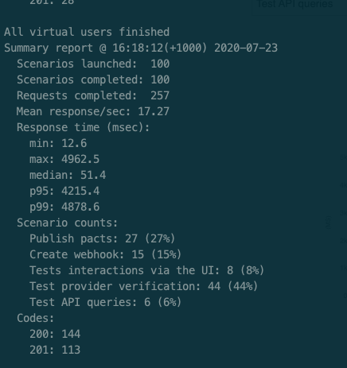
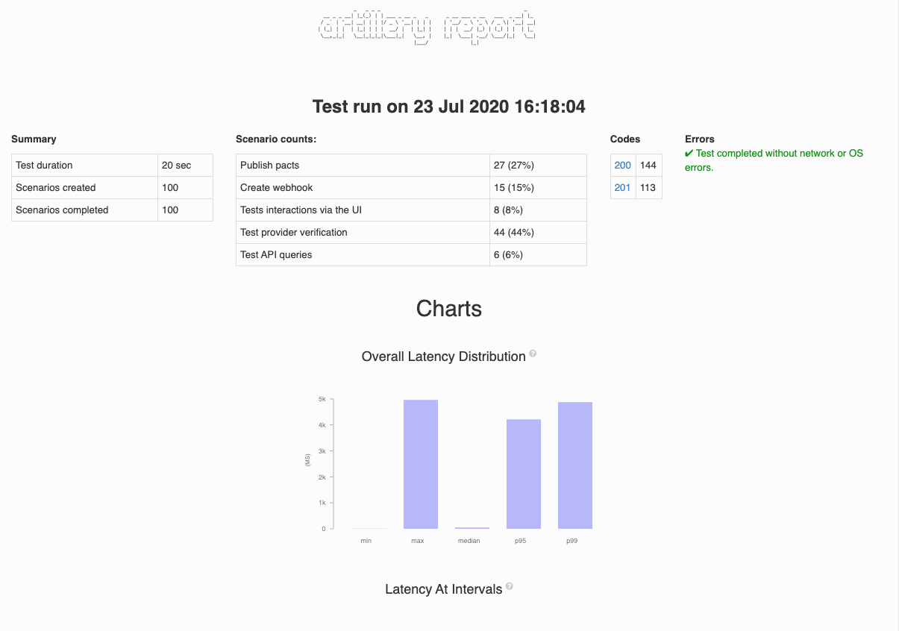

# Load Testing a PactFlow On-Premise Installation

A simple load test for PactFlow installations.

The goals of this test framework are threefold:

1. Create a base, representative load through a pactflow installation, so that you can run resilience, chaos and other tests to understand the potential impact to users
1. Understand scaling properties - e.g. is it CPU, I/O or network bound - in order to tune autoscaling, metrics and alarms
1. Understand the limits of the system

## Installation

*Prerequisites*
* NodeJS v8+
* npm 5+
* A running PactFlow system

```
npm i
```

## Precautions

We know that you'll be careful, but here is our obligatory warning _just in case_ and so we can say _"we told you so"_:

It is not recommended to run this on your production system, or a system that a user depends on. It is potentially destructive and is likely to be disruptive to active users. Really, it's intended for shaking out infrastructure in a non-production environment.

## Structure & Key Components

* `./fixtures` - test data and environment specific config
* `./src` - specific scripts for use within the Artillery tests
* `./setup.yml` - the script to setup the scenario
* `./baseline.yml` - the main scenario load runner
* `./teardown.yml` - the script to tear down data from the load test

## Running

The setup is configurable for multiple environments with the `-e` switch.

### 1. Set the host & authentication token for the test

* Update the Host (default is `localhost`) `./fixtures/accounts-dev.csv` to the hostname of your PactFlow instance (do not include the protocol here)
* Get a read/write API token from your running PactFlow instance Bearer token in `./fixtures/accounts-dev.csv`.
* Set the `environments.dev.target` URL in `./baseline.yml` to your running PactFlow instance

### 2. Setup base data

This will pre-seed a number of consumers, providers and contracts into the system.

```
npm run setup
```

### 3. Run the load test

```
npm run load
```

<p align="center">
  
</p>

### 4. Review the report

```
npm run report
```

It should produce a pretty report that looks something like this:

<p align="center">
  
</p>


### 5. Teardown/Cleanup

This will remove all pacticipants and related resources that were created by the test. NOTE that this does not include webhooks.

```
npm run teardown
```

### Adjusting the scenarios

The scenarios are currently loosely balanced based on the mix that we (PactFlow) see on our cloud platform. You may need to adjust the mix for your specific needs.

The current scenarios we support:

1. Publishing Pacts
1. Provider Verification
1. Creating Webhooks
1. General API querying
1. UI interactions

Edit the `flows` section of `baseline.yml` to add/remove scenarios, and adjust any `weights` to get the balance you need.

The current load test is fairly basic - 10 users arriving per second for 1 minute, each running one of the (weighted) random scenarios. Some scenarios perform multiple HTTP requests.

See https://artillery.io/ for complete documentation on the tool.

## Cleaning up

Trick question! This is really intended for ephemeral infrastructure or testing out the performance of a new stack.

The teardown script is a "best effort" type thing - any customisations to the script may make cleaning up quite difficult. There is no simple way to cleanup here; tear down and rebuild the stack.